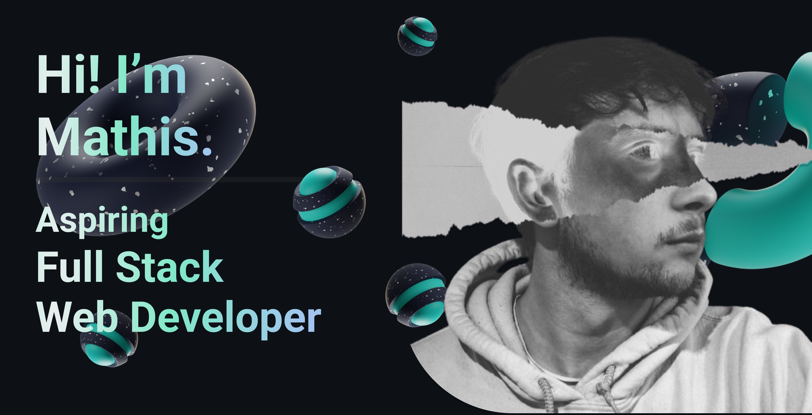

---

#  A propos de moi :

Passionné par les défis, la précision et les solutions concrètes, j’ai
découvert le développement Web pendant le confinement COVID-19.
Initialement attiré par la chirurgie, j’ai réorienté ma rigueur scientifique vers
la création de solutions digitales. Après avoir testé un cursus en
informatique de gestion, j’ai préféré une formation en développement web,
plus axée sur la pratique.   

💡 J'adore apprendre de nouvelles technologies et relever des défis techniques pour améliorer mes compétences.

---

##  Ce que je fais actuellement :  
-  Formation intensive en développement Web full stack.  
-  Apprentissage de technologies modernes comme **HTML**, **CSS**, **JavaScript**, **Node.js**, **React.js**, **Angular**, **Express**, et **MongoDB**.  
-  Projets pratiques et collaboratifs pour renforcer mes compétences techniques et mon expérience. 

---

##  Mes outils et compétences actuelles en développement :  
| 🌐 **Frontend**       | 💾 **Backend**         | 🗄️ **Bases de données** | 🔧 **Outils**                  |
|-----------------------|-----------------------|--------------------------|--------------------------------|
| 

 | 

 | 

 | 

 |
 
---

##  Me retrouver :  
-   [Mathis Derwael](www.linkedin.com/in/mathis-derwael)  
-   [mathis.derwael@gmail.com](mailto:mathis.derwael@gmail.com)
-   [PortfoliOS](https://tr0lgar.github.io/portfoliOS/) *(work in progress)*   

Merci de visiter mon GitHub ! N’hésitez pas à explorer mes projets et à me contacter pour collaborer ou échanger. 🚀
